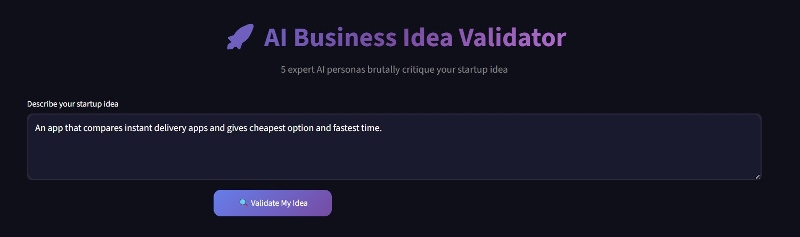
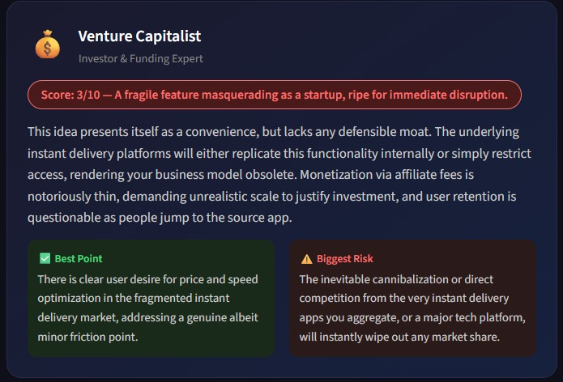
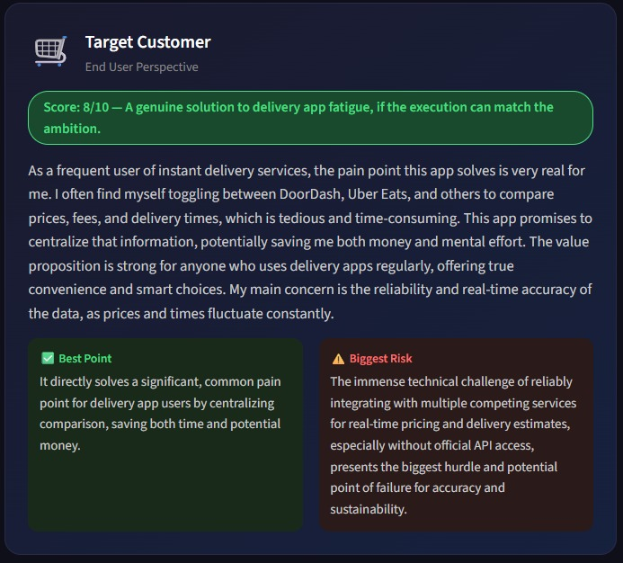
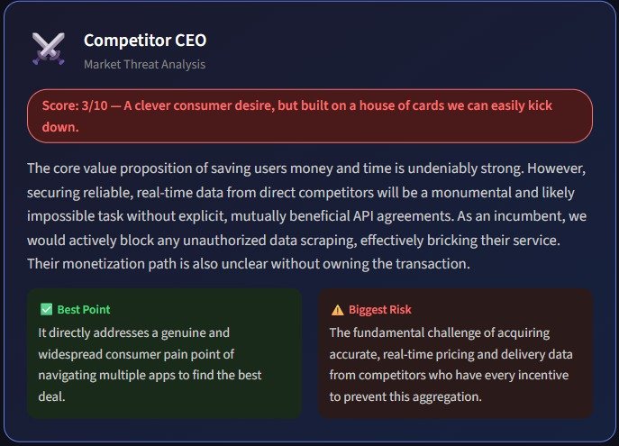
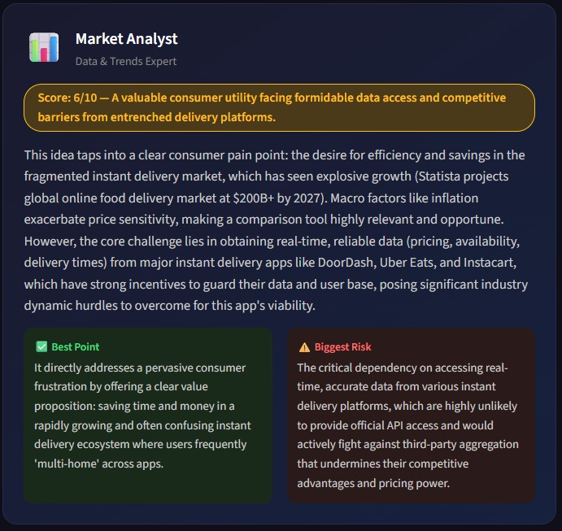
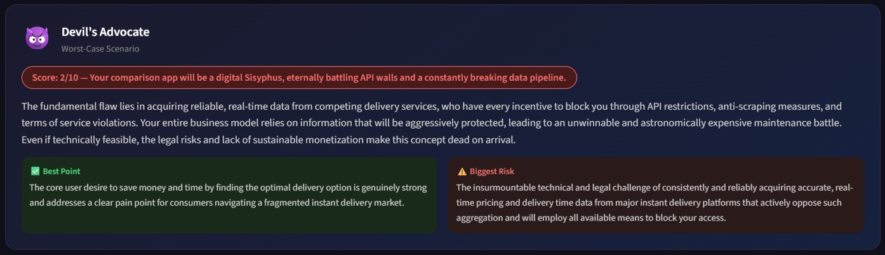
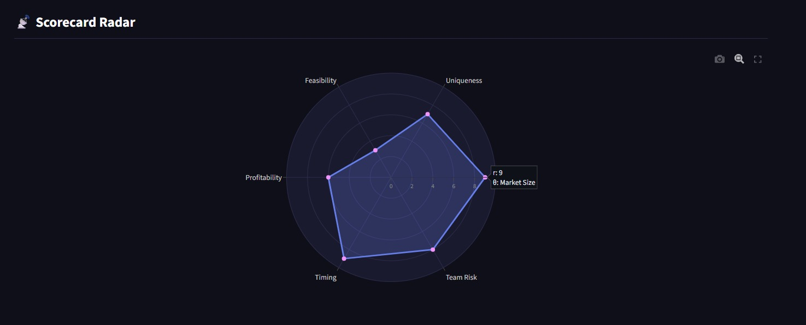
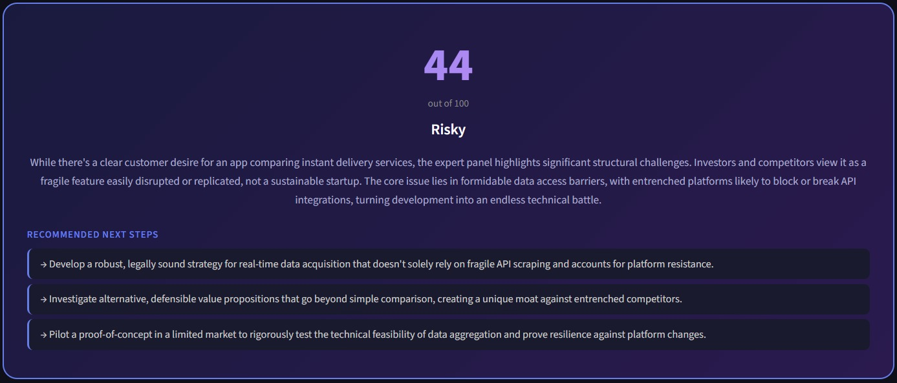

<div align="center">

# 🚀 AI Business Idea Validator

### Evaluate Your Startup Like You're Pitching to an Entire Boardroom of Experts

An AI-powered startup validation platform that uses **Google Gemini 2.5 Flash** to simulate five independent business experts, analyze any startup idea, generate a visual scorecard, and produce a final investment-style verdict.

<br>


</div>

---

# 📑 Table of Contents

- [Overview](#-overview)
- [How It Works](#-how-it-works)
- [Features](#-features)
- [Meet the AI Panel](#-meet-the-ai-panel)
- [Screenshots](#-screenshots)
- [Tech Stack](#-tech-stack)
- [Installation](#-installation)
- [Project Structure](#-project-structure)
- [Future Improvements](#-future-improvements)
- [What I Learned](#-what-i-learned)

---

# 💡 Overview

Every startup founder asks:

> **"Is my idea actually good?"**

Most AI tools return a single opinion.

This project goes a step further.

It creates a panel of five specialized AI experts that independently analyze your startup idea from completely different viewpoints before combining their opinions into one comprehensive business evaluation.

The application also generates a visual radar scorecard so you can instantly identify your strengths and weaknesses.

---

# ⚙️ How It Works

```text
                  Startup Idea
                        │
                        ▼
         ┌───────────────────────────┐
         │  Google Gemini 2.5 Flash  │
         └───────────────────────────┘
                        │
      ┌──────────────────────────────────────┐
      │                                      │
      ▼                                      ▼
 Venture Capitalist                  Target Customer
 Competitor CEO                      Market Analyst
 Devil's Advocate
      │
      ▼
Parallel AI Analysis (ThreadPoolExecutor)
      │
      ▼
 Structured JSON Responses
      │
      ▼
 Plotly Radar Scorecard
      │
      ▼
 Final Startup Verdict
```

---

# ✨ Features

- 🤖 Five independent AI expert personas
- ⚡ Parallel AI execution for faster responses
- 📊 Interactive Plotly radar chart
- 🏆 AI-generated final business verdict
- 📈 Six-dimensional startup scoring
- 🎨 Modern dark-themed UI
- 🔐 Secure Gemini API key input
- 📱 Responsive Streamlit dashboard
- 📦 Structured JSON responses for reliable rendering

---

# 👥 Meet the AI Panel

| Persona | Responsibility |
|---------|----------------|
| 💰 Venture Capitalist | Investment potential & scalability |
| 🛒 Target Customer | Product usefulness & willingness to pay |
| ⚔️ Competitor CEO | Competitive threats & market positioning |
| 📊 Market Analyst | Market trends & opportunity analysis |
| 😈 Devil's Advocate | Risks, weaknesses & failure scenarios |

---

# 📸 Screenshots

## 🖥 Home Screen



---

## 💰 Venture Capitalist



---

## 🛒 Target Customer



---

## ⚔️ Competitor CEO



---

## 📊 Market Analyst



---

## 😈 Devil's Advocate



---

## 📊 Radar Scorecard



---

## 🏆 Final Verdict



---

# 🛠 Tech Stack

| Technology | Purpose |
|------------|---------|
| Python | Core programming language |
| Streamlit | Interactive web application |
| Google Gemini 2.5 Flash | AI model |
| Plotly | Interactive radar chart |
| ThreadPoolExecutor | Concurrent persona execution |
| JSON | Structured AI responses |

---

# 🚀 Installation

Clone the repository

```bash
git clone https://github.com/YOUR_USERNAME/AI-Business-Idea-Validator.git
```

Move into the project

```bash
cd AI-Business-Idea-Validator
```

Install dependencies

```bash
pip install -r requirements.txt
```

Run the application

```bash
streamlit run app.py
```

Enter your Gemini API key in the sidebar and start validating startup ideas.

---

# 📂 Project Structure

```
AI-Business-Idea-Validator/
│
├── app.py
├── README.md
├── requirements.txt
└── images/
    ├── home-screen.jpeg
    ├── venture-capitalist.jpeg
    ├── target-customer.jpeg
    ├── competitor-ceo.jpeg
    ├── market-analyst.jpeg
    ├── devils-advocate.jpeg
    ├── radar-scorecard.jpeg
    └── final-verdict.jpeg
```

---

# 🧠 What I Learned

- Prompt engineering
- Persona prompting
- Structured JSON generation
- Parallel API execution using multithreading
- Building interactive Streamlit dashboards
- Data visualization using Plotly
- Designing AI-assisted decision-support systems

---

# 🚀 Future Improvements

- 📄 PDF report export
- 📈 Business Model Canvas generation
- 💹 TAM / SAM / SOM estimation
- 📊 SWOT analysis
- 🤝 Investor pitch suggestions
- 📂 Startup history
- 👤 User authentication
- ☁️ Cloud deployment

---

<div align="center">

## ⭐ If you found this project interesting

Please consider starring the repository!

Made with ❤️ using Python, Streamlit & Google Gemini

</div><div align="center">

# 🚀 AI Business Idea Validator

### Evaluate Your Startup Like You're Pitching to an Entire Boardroom of Experts

An AI-powered startup validation platform that uses **Google Gemini 2.5 Flash** to simulate five independent business experts, analyze any startup idea, generate a visual scorecard, and produce a final investment-style verdict.

<br>


</div>

---

# 📑 Table of Contents

- [Overview](#-overview)
- [How It Works](#-how-it-works)
- [Features](#-features)
- [Meet the AI Panel](#-meet-the-ai-panel)
- [Screenshots](#-screenshots)
- [Tech Stack](#-tech-stack)
- [Installation](#-installation)
- [Project Structure](#-project-structure)
- [Future Improvements](#-future-improvements)
- [What I Learned](#-what-i-learned)

---

# 💡 Overview

Every startup founder asks:

> **"Is my idea actually good?"**

Most AI tools return a single opinion.

This project goes a step further.

It creates a panel of five specialized AI experts that independently analyze your startup idea from completely different viewpoints before combining their opinions into one comprehensive business evaluation.

The application also generates a visual radar scorecard so you can instantly identify your strengths and weaknesses.

---

# ⚙️ How It Works

```text
                  Startup Idea
                        │
                        ▼
         ┌───────────────────────────┐
         │  Google Gemini 2.5 Flash  │
         └───────────────────────────┘
                        │
      ┌──────────────────────────────────────┐
      │                                      │
      ▼                                      ▼
 Venture Capitalist                  Target Customer
 Competitor CEO                      Market Analyst
 Devil's Advocate
      │
      ▼
Parallel AI Analysis (ThreadPoolExecutor)
      │
      ▼
 Structured JSON Responses
      │
      ▼
 Plotly Radar Scorecard
      │
      ▼
 Final Startup Verdict
```

---

# ✨ Features

- 🤖 Five independent AI expert personas
- ⚡ Parallel AI execution for faster responses
- 📊 Interactive Plotly radar chart
- 🏆 AI-generated final business verdict
- 📈 Six-dimensional startup scoring
- 🎨 Modern dark-themed UI
- 🔐 Secure Gemini API key input
- 📱 Responsive Streamlit dashboard
- 📦 Structured JSON responses for reliable rendering

---

# 👥 Meet the AI Panel

| Persona | Responsibility |
|---------|----------------|
| 💰 Venture Capitalist | Investment potential & scalability |
| 🛒 Target Customer | Product usefulness & willingness to pay |
| ⚔️ Competitor CEO | Competitive threats & market positioning |
| 📊 Market Analyst | Market trends & opportunity analysis |
| 😈 Devil's Advocate | Risks, weaknesses & failure scenarios |

---

# 📸 Screenshots

## 🖥 Home Screen


---

## 💰 Venture Capitalist


---

## 🛒 Target Customer


---

## ⚔️ Competitor CEO


---

## 📊 Market Analyst


---

## 😈 Devil's Advocate


---

## 📊 Radar Scorecard


---

## 🏆 Final Verdict


---

# 🛠 Tech Stack

| Technology | Purpose |
|------------|---------|
| Python | Core programming language |
| Streamlit | Interactive web application |
| Google Gemini 2.5 Flash | AI model |
| Plotly | Interactive radar chart |
| ThreadPoolExecutor | Concurrent persona execution |
| JSON | Structured AI responses |

---

# 🚀 Installation

Clone the repository

```bash
git clone https://github.com/YOUR_USERNAME/AI-Business-Idea-Validator.git
```

Move into the project

```bash
cd AI-Business-Idea-Validator
```

Install dependencies

```bash
pip install -r requirements.txt
```

Run the application

```bash
streamlit run app.py
```

Enter your Gemini API key in the sidebar and start validating startup ideas.

---

# 📂 Project Structure

```
AI-Business-Idea-Validator/
│
├── app.py
├── README.md
├── requirements.txt
└── images/
    ├── home-screen.jpeg
    ├── venture-capitalist.jpeg
    ├── target-customer.jpeg
    ├── competitor-ceo.jpeg
    ├── market-analyst.jpeg
    ├── devils-advocate.jpeg
    ├── radar-scorecard.jpeg
    └── final-verdict.jpeg
```

---

# 🧠 What I Learned

- Prompt engineering
- Persona prompting
- Structured JSON generation
- Parallel API execution using multithreading
- Building interactive Streamlit dashboards
- Data visualization using Plotly
- Designing AI-assisted decision-support systems

---

# 🚀 Future Improvements

- 📄 PDF report export
- 📈 Business Model Canvas generation
- 💹 TAM / SAM / SOM estimation
- 📊 SWOT analysis
- 🤝 Investor pitch suggestions
- 📂 Startup history
- 👤 User authentication
- ☁️ Cloud deployment

---

<div align="center">

## ⭐ If you found this project interesting

Please consider starring the repository!

Made with ❤️ using Python, Streamlit & Google Gemini

</div>
